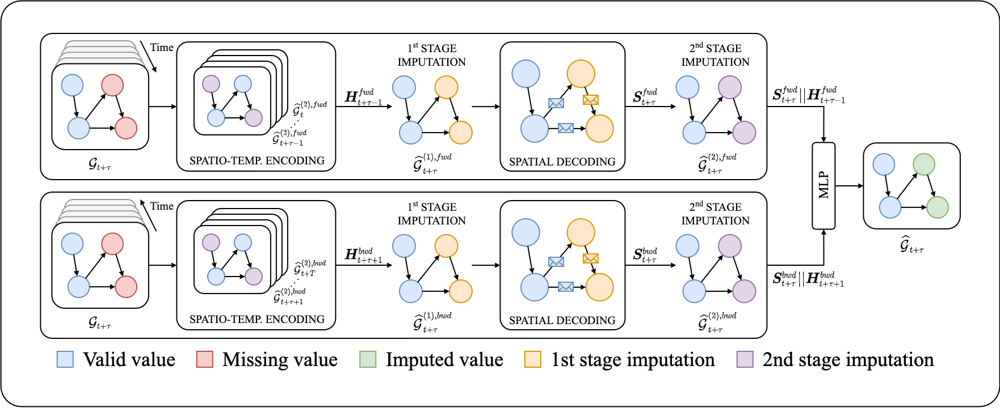

# Papers Name [link]

- #TODO: Abstract of the paper.
- #TODO: A figure of the proposed method.
- #TODO: How to run the code
  - Env
  - Running and the results

<!---

-->

<!---
---

<h2 align=center>GRIN in a nutshell</h2>

The [paper](https://arxiv.org/abs/2108.00298) introduces __GRIN__, a method and an architecture to exploit relational inductive biases to reconstruct missing values in multivariate time series coming from sensor networks. GRIN features a bidirectional recurrent GNN which learns __spatio-temporal node-level representations__ tailored to reconstruct observations at neighboring nodes.

  

--->

## Datasets

All the datasets used in the experiment, except CER-E, are open and can be downloaded from this [link](https://mega.nz/folder/qwwG3Qba#c6qFTeT7apmZKKyEunCzSg). The CER-E dataset can be obtained free of charge for research purposes following the instructions at this [link](https://www.ucd.ie/issda/data/commissionforenergyregulationcer/). We recommend storing the downloaded datasets in a folder named `datasets` inside this directory.

## Configuration files

The `config` directory stores all the configuration files used to run the experiment. They are divided into folders, according to the model.

